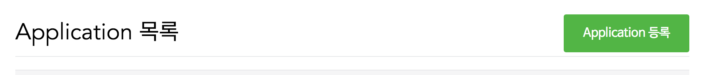
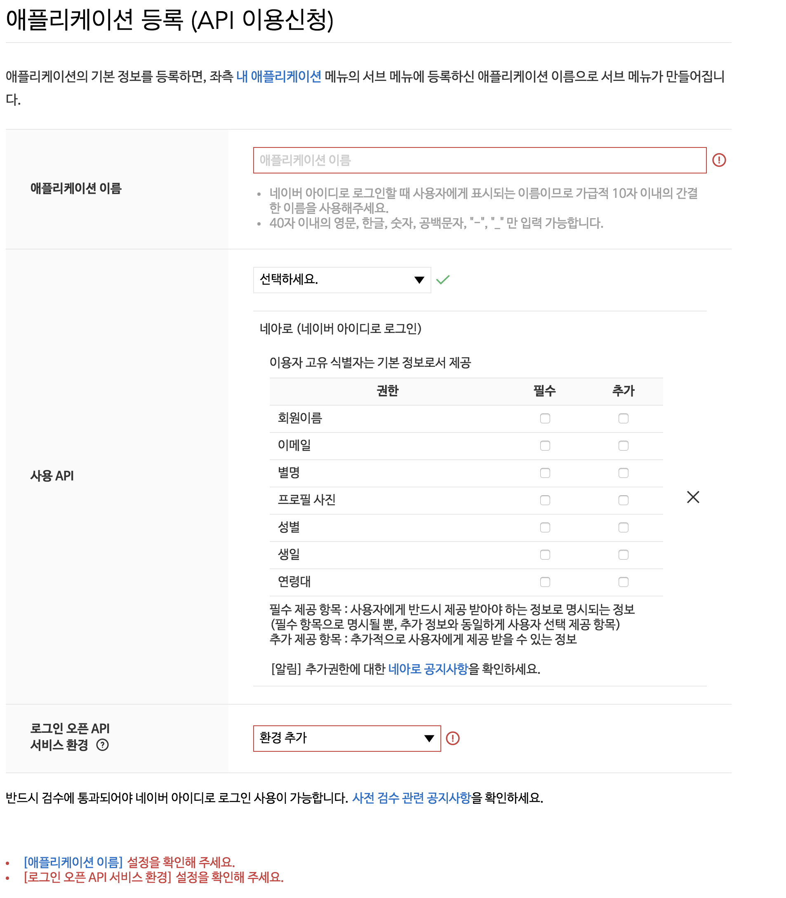
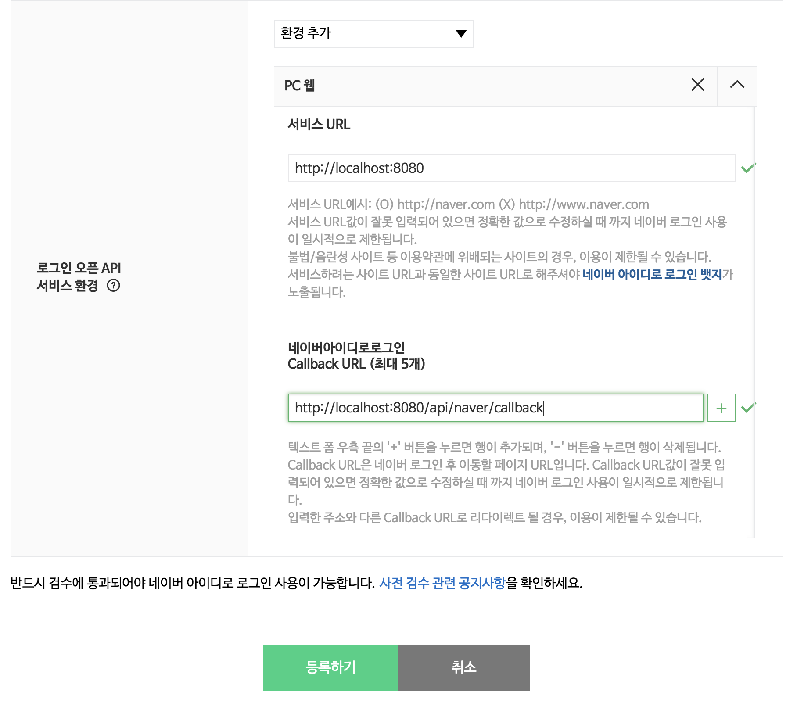
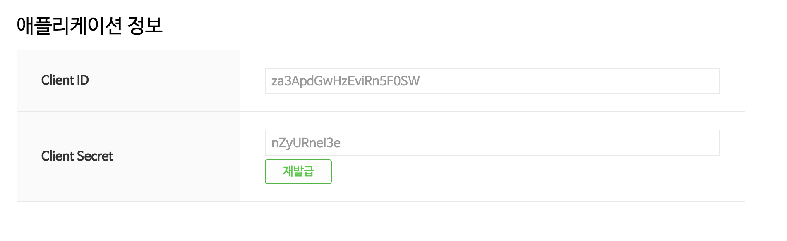

# Naver Social Login 정리
- - -

## 네이버 아이디 로그인(네아로)

### 네이버 로그인 Application 생성
[네아로 Developer](https://developers.naver.com/apps/#/list) 여기 링크를 클릭한 후 Application을 생성을 해주면 됩니다.
밑의 사진에서 `Application 등록`을 누른 후 사용 API를 네아로를 선택해주고 받고싶은 정보들을 선택해주면 됩니다.



로그인 오픈 API 서비스 환경 설정 해주어야 하는 환경 추가를 PC웹으로 개발을 할 것이기 때문에 `PC웹`으로 선택해주면 됩니다.
밑에와 같이 등록을 해준 후 등록하기를 눌러주면 Application등록은 완료가 됩니다.


위의 Applicaation 등록이 완료가 되면 ClientID와 ClientSecret을 주는데 이것을 잘 기억해두어야 합니다. 그리고 한가지 더~!! 위에서 입력했던 CallbackUrl도 기억해 주어야 합니다.


### Node.js에서 사용하는 코드
위에서 기억을 해두었던 ClientID와 ClientSecret, CallbackUrl을 밑에서 입력을 해주어야 합니다.
이 코드는 Naver 로그인을 하기위한 버튼으로 Naver로그인 페이지로 Redirect 시켜주는 코드입니다.
저는 ClientID와 ClientSecret, CallbackUrl을 다른 곳에 저장을 해두었습니다.
```js
const loginButton = (req, res, next) => {
  const state = 'hLiDdL2uhPtsftcUsad';
  const naver_api_url = `https://nid.naver.com/oauth2.0/authorize?response_type=code&client_id=${Oauth.naver.clientId}&redirect_uri=${Oauth.naver.callbackURL}&state=${state}`;
  res.writeHead(200, { 'Content-Type': 'text/html;charset=utf-8' });
  res.end('<a href=\'' + naver_api_url + '\'></a>');
};
```

CallbackUrl로 Naver에서 Application을 만들때 선택해주었던 것들을 보내줍니다.
이제 받아온 값들을 자신의 DB에 저장을 해야합니다.

Naver에서 주의사항은 위의 주소로 보내면 AccessToken만 주기 때문에 Profile을 불러오기위해 요청을 한번 더 해주어야 합니다. 밑에서 `Profile 가져오는 부분`이라고 써놓은 부분부터는 AccessToken을 사용하여 프로필을 가져오는 부분입니다.
```js
import rp from 'request-promise';

/** naver login */
authSchema.statics.naverLogin = (code, state) => {
  const { clientId, clientSecret, callbackURL } = Oauth.naver;
  const api_url = `https://nid.naver.com/oauth2.0/token?grant_type=authorization_code&client_id=${clientId}&client_secret=${clientSecret}&redirect_uri=${callbackURL}&code=${code}&state=${state}`;
  const options = {
    method: 'GET',
    uri: api_url,
    headers: { 'X-Naver-Client-Id': clientId, 'X-Naver-Client-Secret': clientSecret },
    json: true,
  };
  /** naver token 가져오는 부분 */
  return rp(options)
    .then(body => {
      if (body) {
        const { access_token } = body;
        /** naver 프로필 가져오는 부분 */
        const api_profileUrl = 'https://openapi.naver.com/v1/nid/me';
        // 띄어쓰기 꼭... 주의해주어야 합니다.
        const token = 'Bearer ' + access_token;
        const optionProfile = {
          method: 'GET',
          uri: api_profileUrl,
          headers: { 'Authorization': token },
          json: true,
        };
        return rp(optionProfile);
      }
    })
    .then(profileBody => {
      if (profileBody) {
        const oauthID = profileBody.response.id;
        const oauthType = OauthTypes.NAVER;
        return Auth.socialLogin(profileBody.response, oauthID, oauthType);
      } else {
        throw new AuthorizationError();
      }
    });
};

/** social login */
authSchema.statics.socialLogin = (profileJson, oauthID, oauthType) => {
  return User.findOne({ oauthID })
    .then(user => {
      if (!user) {
        return User.create({
          oauthID,
          email: profileJson.email,
          name: profileJson.name,
          confirmed: true,
          oauthType,
        })
          .then(user => user.setAuthor(user).save())
          .then(user => {
            return Auth.sign(user)
              .then(auth => auth.save());
          });
      } else {
        return Auth.sign(user)
          .then(auth => auth.save());
      }
    });
};
```