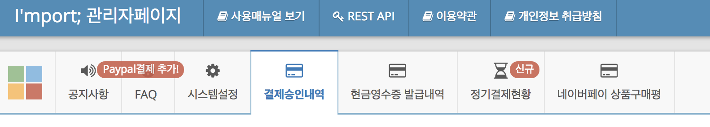
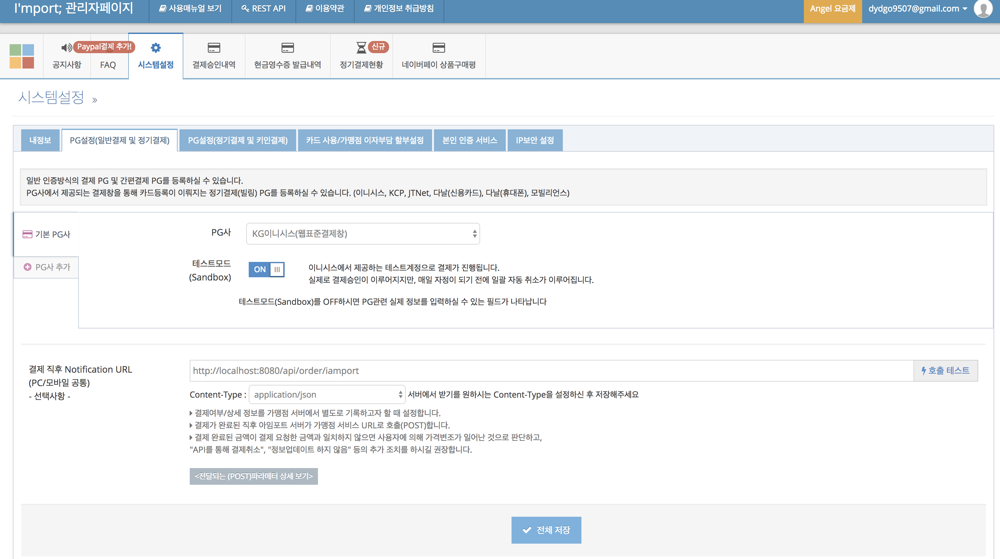
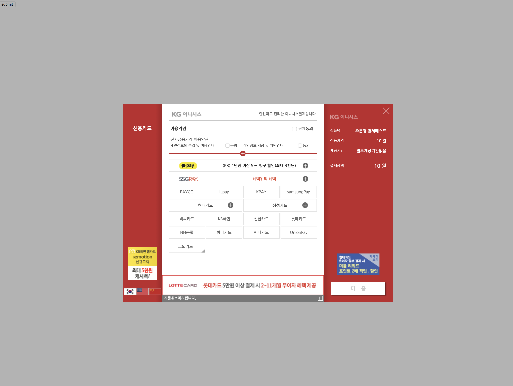

# 아임포트 (결제서비스 연동) 정리
- - -

## IamPort에 대해서

아임포트는 결제를 할 때 PG서비스와 결제서비스를 좀 더 쉽게 사용할 수 있도록 도와주는 서비스입니다.

## IamPort 회원가입 및 PG등록하는 법

[Iamport DashBoard](https://admin.iamport.kr/payments) <- 이 링크를 누르면 대쉬보드로 이동하실 수 있습니다.

회원가입을 한 후 로그인을 하시면 `I'mport;관리자페이지`라고 뜨는 페이지가 나옵니다.



위 사진과 같이 나오는데 `시스템설정`이라는 것을 누르면 `가맹점 식별코드`, `REST API키`, `REST API secret`이 나오는데 이 부분을 잘 기억해주세요~!!

다음은 PG사를 설정해주어야 합니다. 밑에 사진처럼 `PG설정(일반결제 및 정기결제)`를 클릭하여 다음과 같이 설정을 해주면 됩니다.

다른 PG사도 추가 할 수 있는데 이때는 왼쪽 중간 쪽에 `PG사 추가`를 눌러서 PG사를 추가해주시면 됩니다.

사진의 밑부분에 있는 `결제 직후 Notification URL`부분은 만약 Front부분에서 결제가 되었는데 결제창이 닫혔을 경우 server로 결제된 정보등을 한번 더 보내주는 역할을 하기 때문에 선택사항이지만 적어주는 것이 좋다.



## Node.js에서 실제 사용되는 코드

### Front부분에서 결제 버튼을 만들어주는 부분

버튼을 만들어 준 후 `<script type="text/javascript" src="https://cdn.iamport.kr/js/iamport.payment-1.1.5.js"></script>` 이 코드를 넣어주어야 합니다.

저는 `jquery`를 사용하여 작성을 하였습니다.

밑에 코드에서 꼭 들어가야하는 부분은 위에서 회원가입하고 받은 가맹점 코드를 작성해주어야 합니다.

그리고 `pg`, `pay_method`, `merchant_uid`, `amount`등은 꼭 등록을 해주어야 합니다.
```html
<!doctype html>
<html lang="en">
<head>
    <meta charset="UTF-8">
    <meta name="viewport"
          content="width=device-width, user-scalable=no, initial-scale=1.0, maximum-scale=1.0, minimum-scale=1.0">
    <meta http-equiv="X-UA-Compatible" content="ie=edge">
    <title>Document</title>

</head>
<body>
<form name="pgForm" method="post" action="javascript:imp()">
    <button type="submit">submit</button>
</form>
<script type="text/javascript" src="https://code.jquery.com/jquery-1.12.4.min.js"></script>
<script type="text/javascript" src="https://cdn.iamport.kr/js/iamport.payment-1.1.5.js"></script>
<script>
  function imp() {
    const IMP = window.IMP;
    IMP.init('가맹점 코드');
    IMP.request_pay({
      pg: 'html5_inicis',
      pay_method: 'card',
      merchant_uid: '',
      name: '주문명:결제테스트',
      amount: 10,
      buyer_email: 'dydgo9507@gmail.com',
      buyer_name: '김용해',
      buyer_tel: '010-5291-1892',
      buyer_addr: '서울특별시 강남구 삼성동',
      buyer_postcode: '123-456',
      m_redirect_url: 'http://localhost:8080/api/order/complete',
    }, function (rsp) {
      if (rsp.success) {
        const msg = rsp;
        document.location.href = `/api/order/iamport?imp_uid=${rsp.imp_uid}&merchant_uid=${rsp.merchant_uid}`;
      } else {
        var msg = '결제에 실패하였습니다.';
        msg += '에러내용 : ' + rsp.error_msg;
      }

      alert(msg);
    });
  }
</script>
</body>
</html>
```

위의 코드가 정상적으로 작동이 되면 밑에 사진처럼 창이 뜨게 됩니다.




### 서버 부분에서 코드 작성

위의 창을 전부 입력하고 돌아오면 query로 `imp_uid`와 `merchant_uid`를 받아 오게 됩니다.

저는 `merchant_uid`를 결제 DB에 _id로 넣어 두었습니다.

저의 코드에서 순서는
1. 결제 DB(Order)를 먼저 생성을 해줍니다. (위에 body로 받아 온 것들을 `buyer`의 정보 등을 먼저 저장해줍니다.)

Router에서는 이렇게 작성을 해주었습니다.

저의 프로젝트에서는 point가 있기 때문에 포인트를 비교해주는 부분이 있습니다.

```js
const add = (req, res, next) => {
  const body = req.body;
  // order.point가 totalPoint보다 많은면 에러를 띄워줘야한다.
  Order.checkPoint(req.author, body)
    .then(order => res.return({ order }))
    .catch(next);
};
```

Model에서는 다음과 같이 작성을 해주었습니다.

다음과 같이 미리 확인이 필요하지 않은 정보들을 먼져 저장을 해주어 Order에 _id를 생성해주었습니다.

```js
// order를 생성하기전에 point가 자신이 가지고 있는 포인트 값보다 높은지 체크 하는 부분
orderSchema.statics.checkPoint = (user, body) => {
  return Point.totalPoint(user._id)
    .then(totalPoint => {
      if (!totalPoint[0]) return Order.createOrder(user, body);
      if (totalPoint[0].total < body.point) throw new PurchasedError();
      return Order.createOrder(user, body);
    });
};
// order를 생성하는 부분 ( cart -> checkout으로)
orderSchema.statics.createOrder = (user, body) => {
    return Order.create({
      status: OrderStatuses.ORDER_READY,
      temporaryUsePoint: body.point,
      buyer_name: body.buyer_name,
      buyer_addr: body.buyer_addr,
      buyer_email: body.buyer_email,
      buyer_postcode: body.buyer_postcode,
      buyer_tel: body.buyer_tel,
      shippingNotice: body.shippingNotice,
    })
      .then(order => order.setAuthor(user).save())
      .then(order =>
        Cart.checkout(user, order)
          .then(() => order),
      )
  }
};
```

2. 결제가 되었을 때 서버로 저장하기 전에 iamport에서 준 정보가 정확한 정보인지 확인을 해줍니다. ( amount, imp_uid, merchant_uid, status와 같은 것들을 정확한지 더블체크해주어야 합니다.) 정보가 전부 통과 되면 DB에 저장을 해줍니다.

Router에서는 다음과 같이 작성하였습니다.

실제 서비스에서는 Order를 Return 해주는 것이 아니라 프론트 페이지로 redirect를 시켜주어야 합니다.

제 코드중에 Model.get()은 Model.findOne()과 같은 코드인데 다른 점은 populate를 자동으로 시켜주고 꼭 _id값으로만 찾을 수 있다는 점입니다.

```js
const complete = (req, res, next) => {
  const { imp_uid, merchant_uid } = req.query;
  Order.get(merchant_uid)
    .then(order => {
      if (!order) throw new NotFoundError();
      order.approval(imp_uid, merchant_uid)
      // TODO: 프론트와 연결해줄때 redirect주소 써주기
      //   .then(() => res.redirect('/'))
        .then(order => res.return({ order }))
        .catch(err => {
          next(err);
          order.orderedFailed(req.author)
            .then(() => order)
        });
    });
};
```

Model에서는 다음과 같이 작성하였습니다.

```js
// iamport를 비교해주는 부분~!! 비교하고 저장해주는 부분
orderSchema.methods.approval = function (imp_uid, merchant_uid) {
  const order = this;
  return iamport.payment.getByImpUid({ imp_uid: imp_uid })
    .then((result) =>
      OrderedCart.find({ order: order._id })
        .then(orderedCarts => {
          if (!orderedCarts) throw new NotFoundError();
          let totalPrice = 0;
          orderedCarts.forEach(orderedCart => totalPrice += orderedCart.price);
          return totalPrice -= order.temporaryUsePoint;
        })
        .then(totalPrice => {
          const { status: imp_status, fail_reason } = result;
          if (imp_status !== 'paid') throw new PurchasedError(fail_reason);
          if (result.currency !== 'KRW') throw new PurchasedError('Mismatched Currency');
          if (result.amount !== totalPrice) throw new PurchasedError('Mismatched Price');
          if (result.merchant_uid !== merchant_uid) throw new PurchasedError('Mismatched merchant_uid');
          return Order.updateOrder(merchant_uid, imp_uid, totalPrice)
            .then(() => order);
        }),
    );
};

//  imp_uid와 status를 저장할때 사용된 포인트와 적립된 포인트도 같이 저장하는 부분
orderSchema.statics.updateOrder = (merchant_uid, imp_uid, totalPrice) => {
  return Order.update({ _id: merchant_uid }, {
    imp_uid,
    paid_amount: totalPrice,
    status: OrderStatuses.ORDER_SUCCESS,
  })
    .then(() => Order.insertPoint(merchant_uid));
};

// 포인트 넣어주는 부분
orderSchema.statics.insertPoint = (merchant_uid) => {
  return Order.findOne({ _id: merchant_uid }).populate('author')
    .then(order => {
      if (!order) throw new NotFoundError();
      if (order.temporaryUsePoint > 0) {
        return Point.usePoints(order.author, order.temporaryUsePoint, order._id)
          .then(() => order);
      }
      return order;
    })
    .then(order =>
      OrderedCart.find({ order: order._id })
        .then(orderedCarts => {
          if (!orderedCarts) throw new NotFoundError();
          let pointEarning = 0;
          orderedCarts.forEach(orderedCart => pointEarning = orderedCart.price * point.quota);
          return Promise.map(orderedCarts, orderedCart => {
            return Point.earnPoints(order.author, pointEarning, orderedCart._id)
              .then(orderedCart => {
                orderedCart.status = OrderStatuses.ORDER_SUCCESS;
                return orderedCart.setAuthor(order.author).save();
              })
              .then(() => order);
          });
        }),
    );
};
```


4. 만약 결제에 실패했을 경우에는 다시 장바구니에 생성을 해주고 Order DB에서는 삭제를 해준 후 다시 결제를 해야합니다.

결제에 실패했을 경우의 코드입니다.

이 때의 중요한점은 장바구니를 되돌려야 되는 것과 해당 물건의 수량을 되돌려야 하는 부분, 주문이 완료된 창에서 결제 실패로 바꿔주는 부분이 중요합니다.
```js
orderSchema.methods.orderedFailed = function (user) {
  const order = this;
  return OrderedCart.find({ order })
    .then(orderedCarts => OrderedCart.resetProduct(orderedCarts, order, user))
    .then(orderedCarts =>
      Promise.each(orderedCarts, orderedCart => {
        return Cart.create({
          product: orderedCart.product,
          quantity: orderedCart.quantity,
        })
          .then(cart => {
            return cart.setAuthor(user).save();
          })
          .then(() => {
            orderedCart.status = OrderStatuses.ORDER_FAILED;
            return orderedCart.setAuthor(user).save();
          });
      }),
    )
    .then(() => order.setAuthor(user).remove());
};
```

이 부분의 코드는 물건의 수량을 되돌리는 부분의 코드입니다.
```js
orderedCartSchema.statics.resetProduct = (orderedCarts, order, user) => {
  return Promise.each(orderedCarts, orderedCart => {
    return Product.get(orderedCart.product)
      .then(product => {
        product.quantity += orderedCart.quantity;
        return product.setAuthor(user).save();
      });
  });
};
```

5. 환불 부분

이 부분은 환불 부분입니다.

Router 부분입니다.

```js
const refund = (req, res, next) => {
  const { imp_uid, merchant_uid } = req.query;
  const { reason } = req.body;

  Order.refund(imp_uid, merchant_uid, reason, req.author)
    .then(order => res.return({ order }))
    .catch(next);
};
```

Model 부분입니다.  이 부분도 결제와 같이 `Iamport`로 결제 취소 요청을 보내야합니다.

```js
// iamport로 결제 취소 요청을 보내는 부분 및 요청이 맞는지 더블 체크하는 부분
orderSchema.statics.refund = (imp_uid, merchant_uid, reason, user) => {
  return iamport.payment.cancel({ imp_uid, merchant_uid })
    .then(result => {
      return Order.findOne({ _id: merchant_uid, imp_uid })
        .then(order => {
          if (!order) throw new PurchasedError();
          const { status: imp_status, fail_reason } = result;
          if (imp_status !== 'cancelled') throw new PurchasedError(fail_reason);
          if (result.merchant_uid !== merchant_uid) throw new PurchasedError('Mismatched merchant_uid');
          order.status = OrderStatuses.ORDER_CANCEL;
          order.reason = reason;
          return order.setAuthor(user).save();
        })
        .then(order => order.cancelPayment(user));
    });
};

// 취소가 완료되면 되돌려야할 부분을 되돌리는 부분입니다.
orderSchema.methods.cancelPayment = function (user) {
  const order = this;
  return OrderedCart.find({ order })
    .then(orderedCarts => {
      // order에 저장되어있는 point값이 0이 아닐때 사용 포인트 삭제해주는 부분
      return Point.findOne({ order })
        .then(point => {
          if (!point) return;
          return point.setAuthor(user).remove();
        })
        .then(() => orderedCarts);
    })
    .then(orderedCarts => {
      // Promise.mapSeries는 retrun값을 그대로 보내주기 때문에 이러한 경우에는 each를 사용해준다.
      // Promise.each는 return 값을 무시하고 들어온 값을 그대로 return해준다.
      return Promise.each(orderedCarts, orderedCart => {
        return Point.findOne({ orderedCart })
          .then(point => {
            if (!point) return;
            return point.setAuthor(user).remove();
          });
      });
    })
    .then(orderedCarts => OrderedCart.resetProduct(orderedCarts, order, user))
    .then(() => order);
};
```